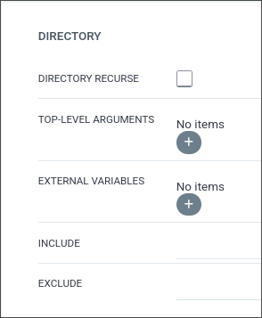

# Argo Workflow

## K3S Set up

So, we need to create the namespace where our app will live and all the secrets (.env) that we need for our code to work:

You can do it with this inside our Raspberry Pi:

```bash
sudo kubectl create namespace echobot-ns
sudo kubectl create secret generic echobot-secrets \
  --from-literal=DISCORD_TOKEN='xxxxxxxx' \
  --from-literal=STORY_CHANNEL_ID='xxxxxxxx' \
  -n echobot-ns
```

## Charts

Now, to finish all of this, lets go to our charts repository and create a directory called exactly as we put it on the .yaml file of the github workflow.

And inside we'll put the yaml files that Argo need, usually it consists of 3 files, a deployment, an ingress and a service:

```bash
mkdir echobot
cd echobot
touch deployment.yaml ingress.yaml service.yaml
```

Inside `deployment.yaml` we'll put the app that we want to run with all the secrets that we created:

```yaml
apiVersion: apps/v1
kind: Deployment
metadata:
  name: deployment
  namespace: echobot-ns
spec:
  selector:
    matchLabels:
      app: echobot
      tier: backend
  replicas: 1
  template:
    metadata:
      labels:
        app: echobot
        tier: backend
    spec:
      containers:
        - name: app
          image: ghcr.io/000volk000/echobot:latest
          env:
            - name: DISCORD_TOKEN
              valueFrom:
                secretKeyRef:
                  name: echobot-secrets
                  key: DISCORD_TOKEN
            - name: STORY_CHANNEL_ID
              valueFrom:
                secretKeyRef:
                  name: echobot-secrets
                  key: STORY_CHANNEL_ID
```

Inside `service.yaml` something similar to:

```yaml
apiVersion: v1
kind: Service
metadata:
  name: service
  labels:
    app: echobot
    tier: backend
spec:
  type: NodePort
  selector:
    app: echobot
    tier: backend
```

And inside `ingress.yaml` something like:

```yaml
apiVersion: networking.k8s.io/v1
kind: Ingress
metadata:
  name: ingress
  labels:
    app: echobot
    tier: backend
spec:
  rules:
    - host: echobot.volkhost.es
      http:
        paths:
          - path: /
            pathType: Prefix
            backend:
              service:
                name: echobot
                port:
	                number: 443
```

Once created the yamls that you need, you should go to the original repo and add a new tag to make it trigger the workflow and change the tag on the chart repo.

## Argo Setups

Lastly lets create the app on Argo, to do so go to the web -> Applications -> New app and fill the fields with the things we just did

<div align="center">
  
</div>

<div align="center">
  
</div>

<div align="center">
  
</div>

Once finished press create and it should work flawlessly.

## FINISH

And that's it, your app will be running flawlessly, you can add all the apps you can think and if you follow the steps it should have an auto deployment always that you add a new version to your deployed apps