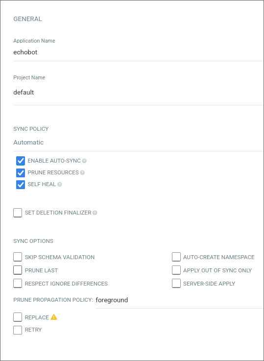
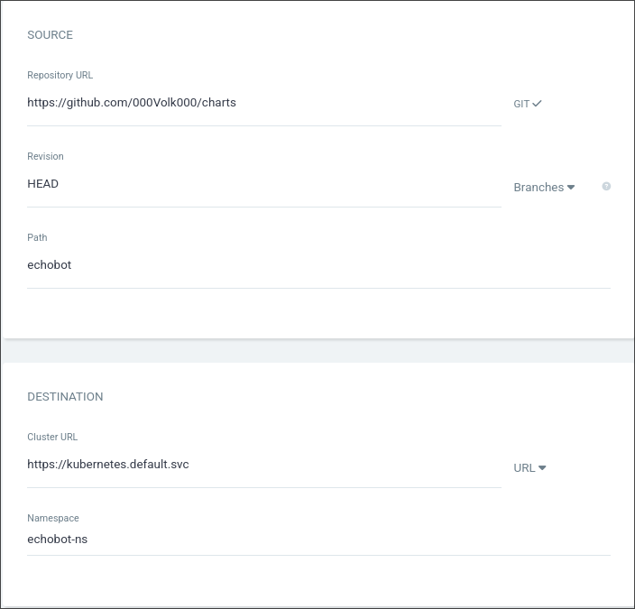

# Argo Workflow

## K3S Set up

We need to create the namespace on kubernetes where our app will live and all the secrets (Environment variables) that we need for our code to work:

You can do it with this commands inside our Raspberry Pi:

```bash
sudo kubectl create namespace <app>-ns
sudo kubectl create secret generic <app>-secrets \
  --from-literal=<key>='<value>' \
  --from-literal=<key>='<value>' \
  -n <app>-ns
```

You can concatenate as much `--from-literal=<key>='<value>'` on the same command as you need for your case.

To add new key-values to the same app after the initial command, you can do:

```bash
kubectl patch secret <app>-secrets -n <app>-ns \
  --type='merge' \
  -p '{"stringData":{"<key>":"<value>"}}'
```

## Charts

Now, to finish all of this, lets go to our charts repository and create a directory called exactly as we put it on the `.github/workflows/deploy.yaml` file of the github workflow  (The environment variable `CHARTS_DIRECTORY`).

```bash
mkdir <CHARTS_DIRECTORY>
cd <CHARTS_DIRECTORY>
```

And inside that directory we'll put the .yaml files that Kubernetes need, there are 5 main file types. Deployment, Service, Ingress, CronJob and PersistentVolumeClaim.

There are some examples of files you might use:

- `deployment.yaml` : This file consists on running the app with the docker CMD command that we putted on the Dockerfile. It has and image so it must be changed by the sed of the github actions of the previous section.

```yaml
apiVersion: apps/v1
kind: Deployment
metadata:
  name: deployment
  namespace: <app>-ns
spec:
  selector:
    matchLabels:
      app: <app>
      tier: <backend/frontend>
  replicas: 1
  template:
    metadata:
      labels:
        app: <app>
        tier: <backend/frontend>
    spec:
      containers:
        - name: app
          image: ghcr.io/<user>/<app>:latest
          env:
            - name: <key>
              valueFrom:
                secretKeyRef:
                  name: <app>-secrets
                  key: <key>
            - name: <key>
              valueFrom:
                secretKeyRef:
                  name: <app>-secrets
                  key: <key>
```

	You can concat all the environment variables that you need at the end of the file or put none

- `service.yaml` this is the file that says how the app will behave to the world:

```yaml
apiVersion: v1
kind: Service
metadata:
  name: <app>-service
  namespace: <app>-ns
  labels:
    app: <app>
    tier: <backend/frontend>
spec:
  type: <NodePort/ClusterIP>
  ports:
    - port: <Port where the app is running inside the container>
  selector:
    app: <app>
    tier: <backend/frontend>

```

-  `ingress.yaml` is the endpoint that will be public to access our app to the port specified on the service.yaml:

```yaml
apiVersion: networking.k8s.io/v1
kind: Ingress
metadata:
  name: <app>-ingress
  namespace: <app>-ns
  labels:
    app: <app>
    tier: <backend/frontend>
spec:
  rules:
    - host: <sublink>.example.com
      http:
        paths:
          - path: /
            pathType: Prefix
            backend:
              service:
                name: <app>-service
                port:
                  number: <Port where the app is running inside the container>

```

- `cronjob.yaml` is the equivalent of making a cron on linux or a systemd timer, it'll execute a command inside a image every time you specify it to.

```yaml
apiVersion: batch/v1
kind: CronJob

metadata:
  name: <app>-cronjob
  namespace: <app>-ns
  labels:
    app: <app>
    tier: <backend/frontend>

spec:
  schedule: "<cron schedule format, for example "0 */4 * * *">"
  jobTemplate:
    spec:
      template:
        spec:
          restartPolicy: <Never/OnFailure>
          containers:
            - name: app
              image: ghcr.io/<user>/<app>:latest
              command: ["<command>", "<arg1>", "<arg2>", ...]
              env:
                - name: <key>
                  valueFrom:
                    secretKeyRef:
                      name: <app>-secrets
                      key: <key>

```

- `persistentvolumeclaim.yaml` is the way to have a persistent storage between pods, because if any pod goes down and kubernetes launches it again, all the storage will be reset because is a new container.

```yaml
apiVersion: v1
kind: PersistentVolumeClaim
metadata:
  name: <app>-pvc
spec:
  accessModes:
    - ReadWriteOnce
  resources:
    requests:
      storage: <Storage needed, for example 1Gi>
```

	If you create a PersistentVolumeClaim you should mount it on the directory you want it to be on the deploy.yaml or cronjob.yaml

>[!NOTE]
>These files are an example of how you can do it, you should create all the .yaml you need for your app with all your needs inside. 

Once created all the files that you need, you should go to the original repo (Where we created the github workflow) and add a new tag to make it trigger the workflow and change the tag on the chart repo with the sed commands.

## Argo Setups

Lastly lets create the app on ArgoCD, this gets all the .yaml on the directory that you did on the charts repo and deploy your app into your cluster, to do so go to the web app on argocd.example.com -> Applications -> New app and fill the fields with the things we just did.

In the General section:
- Fill the application name with your desired name to appear on ArgoCD for you to know which app is wich.
- Project name is a menu with only 1 option, select it
- In sync policy put it on automatic and enable all 3 checkboxes

<div align="center">
  
</div>

On the Source section:
- The repository url is a menu with only 1 option, select it
- On path, type the directory all your .yaml are inside the charts repo (CHARTS_DIRECTORY)

On the Destination section:
- The cluster url is a menu with only 1 option, pick it
- In namespace put the namespace you created before (app-ns)

<div align="center">
  
</div>

Let the rest as is, and press the upper button `create` and it should deploy your app.

## FINISH

And that's it, your app will be running flawlessly, you can add all the apps you can think and if you follow the steps it should have an automated deployment always that you add a new version tag to your github repo of the app.