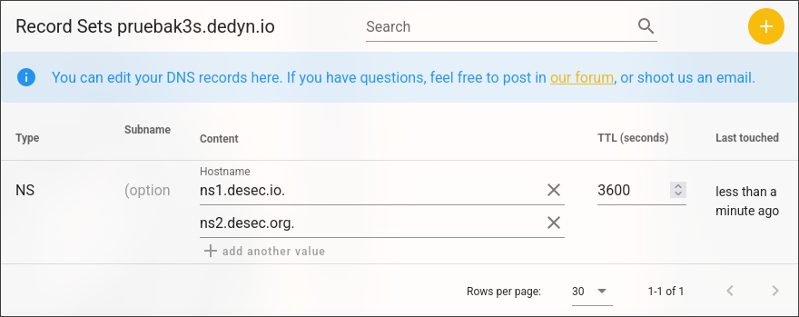
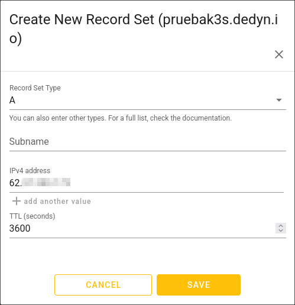
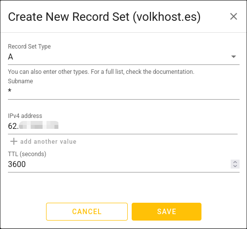

# DNS Configuration

## Domain Creation

We'll manage all of this section with [deSEC](https://desec.io/).

To start with the configuration we'll need a domain, you can use a bought one of your preference or create for free a subdomain of dedyn.io (`*.dedyn.io`).

Once created and account and created your domain you will get something like this:

  

Here lets create 2 records (With the + icon) 1 type A for the base url and other type A for the wildcard.
## Type A
This record is what tells what is our ip to access, so we need to put the public ip address that we got on the previous step.

  

Once done press save and when the DNS propagation takes effect you can access to the ssh from anywhere with your new domain.

  

## WildCard

Lastly we want that every subdomain `*.yourdomain.dedyn.io` or `*.yourdomain` comes to our public IP address too and handle it with the Raspberry Pi.

Why? Because in that way we can access our apps with the desired subdomain for example jellyfin.yourdomain.dedyn.io having a easier direct access.

Just like in the last section, we press the + icon but this time select the A option again but now we'll put in Subname an \*

  

And just like before, if you wait to the DNS propagation to make effect you can try to do ssh to any subdomain and it should work.

  

## Next Step

Now we have a domain and any subdomain pointing to our IP address but we need to get the ssl/tls certificate and make it Dynamic so if our ip address change it doesn't break anything -> [DDNS Installation](DDNS%20Installation.md)
