# Raspberry Pi Hardware

## Active Cooler

We need to put the active cooler with the thermal pads on the 3 heat points like in this photo

  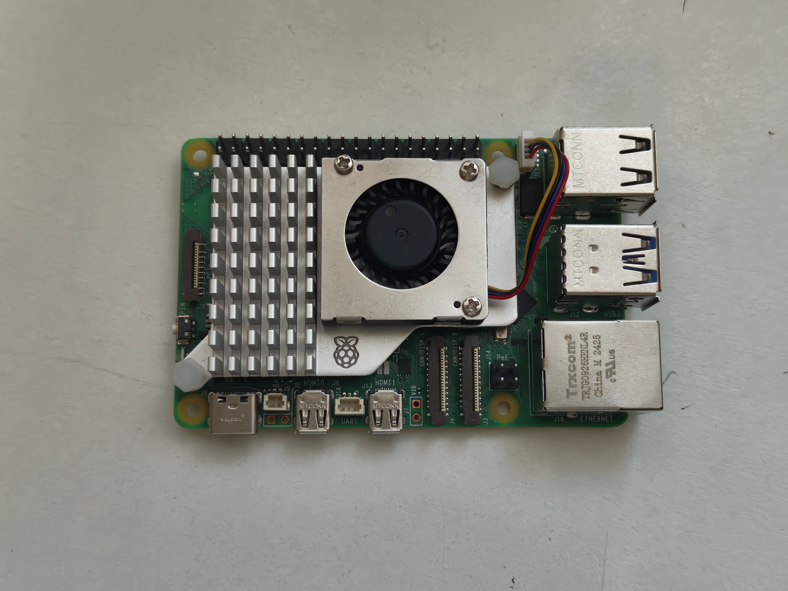

Once put, you need to press the 2 white spring-loaded pins that are situated on the corner of the Raspberry and that if you positioned the active cooler right, it should be right above a holes on the Raspberry Pi designed to clamp in place the cooler.

Press the springs until it gets to the other side, like this

  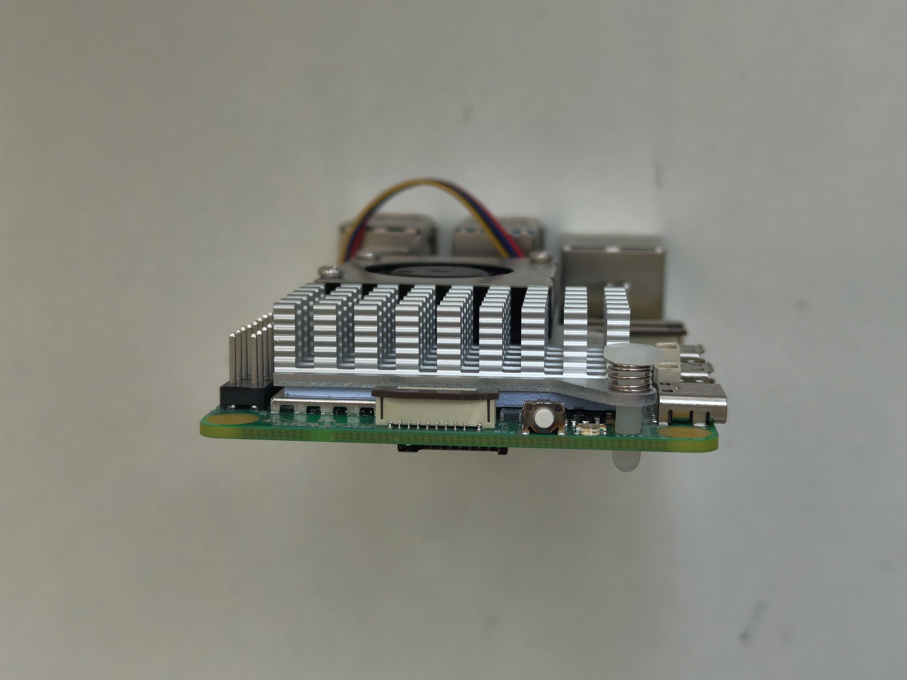

Lastly, we'll connect the PWM fan cable onto the corresponding place.

To do that we need to remove the plastic cover that is situated on the top-right side of the Raspberry Pi and connect there the connector, it should be like this

  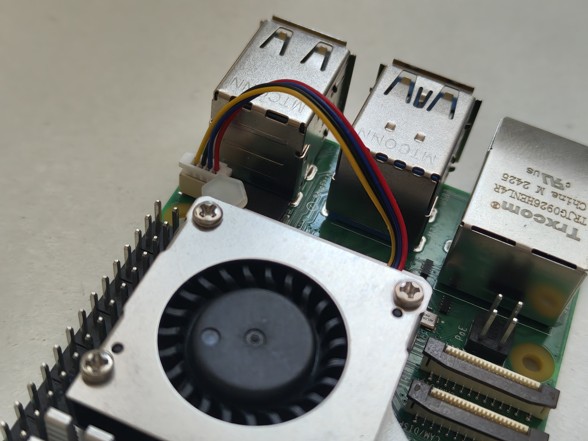

## Pimoroni M.2 Base + NVMe SSD

To start of we need to put 4 of the small volts to the corners of the base and screw the standoff to the volt, like this

  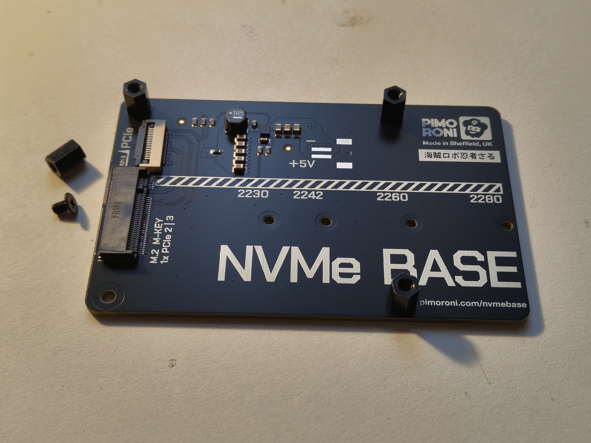

Now whe shall put a thin screw and a nut on the lenght of our NVMe

  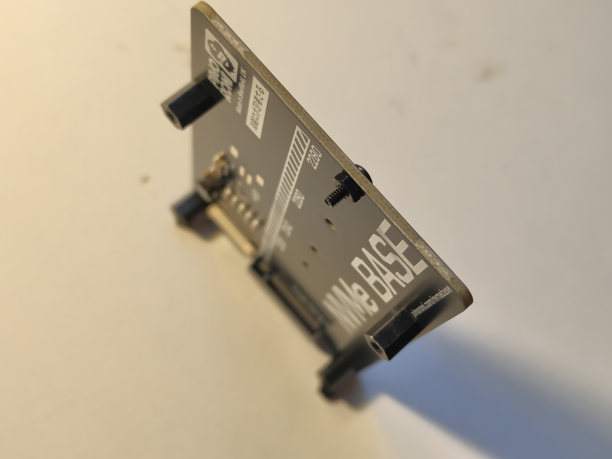

To then place the NVMe connecting it to the M.2 M-key and slipping another nut to tight the NVMe in place, should be like this

  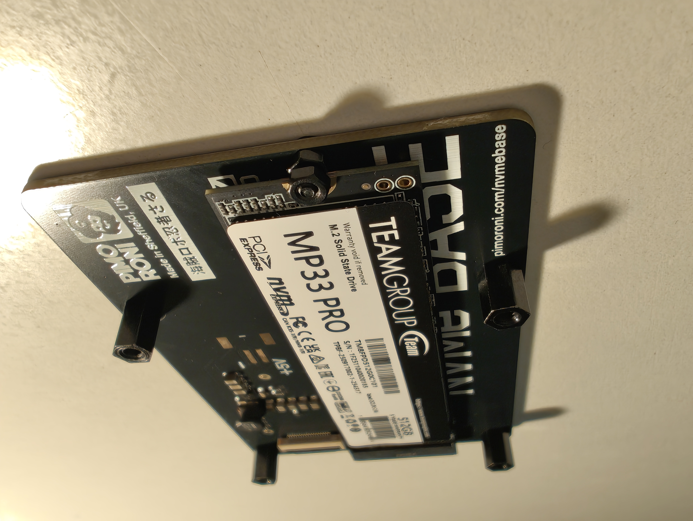

Once done we just need to connect it to the Raspberry Pi, so we'll start placing the PCIe PIPE connector to the Raspberry, lifting up the safe, placing the connector and closing the safe

  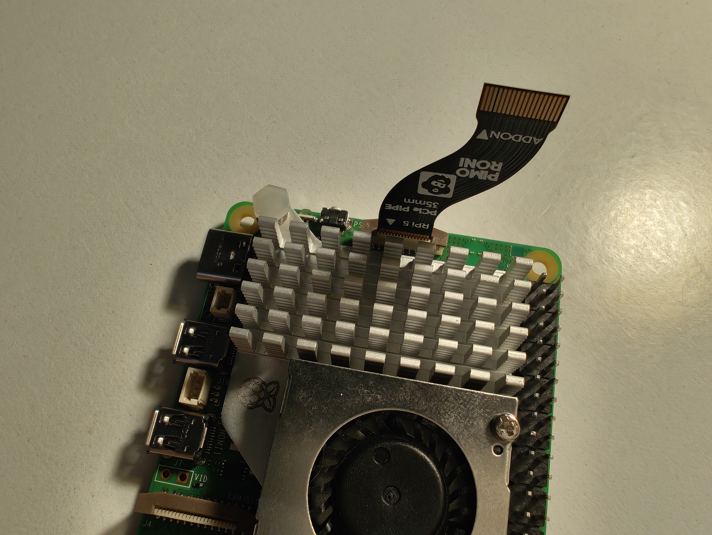

Now we do the same connection carefully to the NVMe adapter

  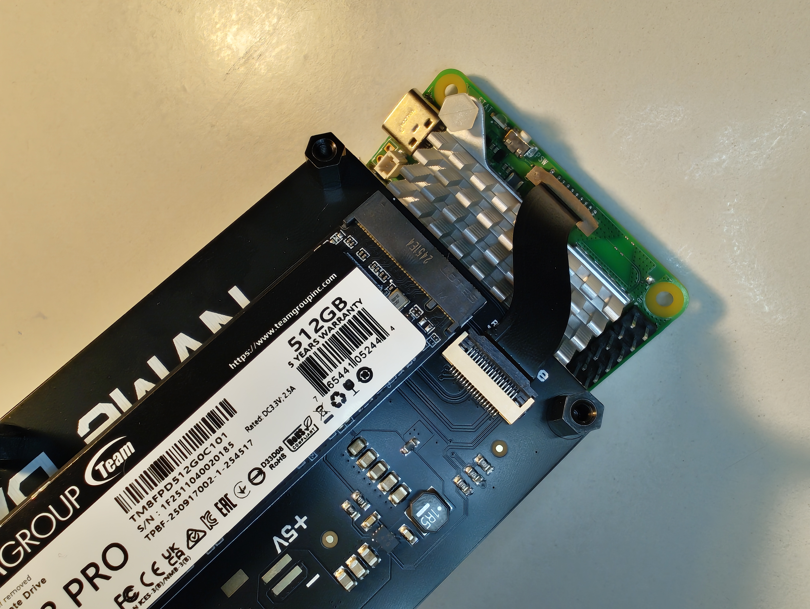

Lastly we place the adapter below of the Raspberry carefully and we place 4 of the small screws to make it thigh in place

  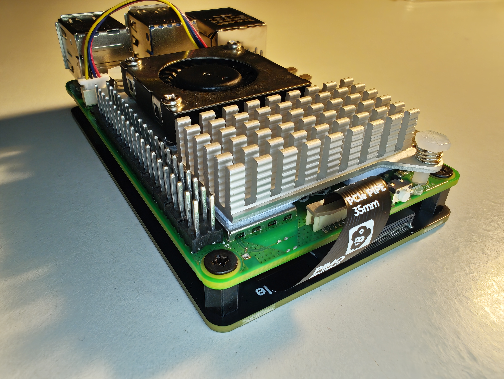

## Geeekpi 4 Layers Acrylic Case

Once done with the nvme adapter we'll replace one by one the lower screws of the nvme base with the screws that come with the Geeekpi Case

  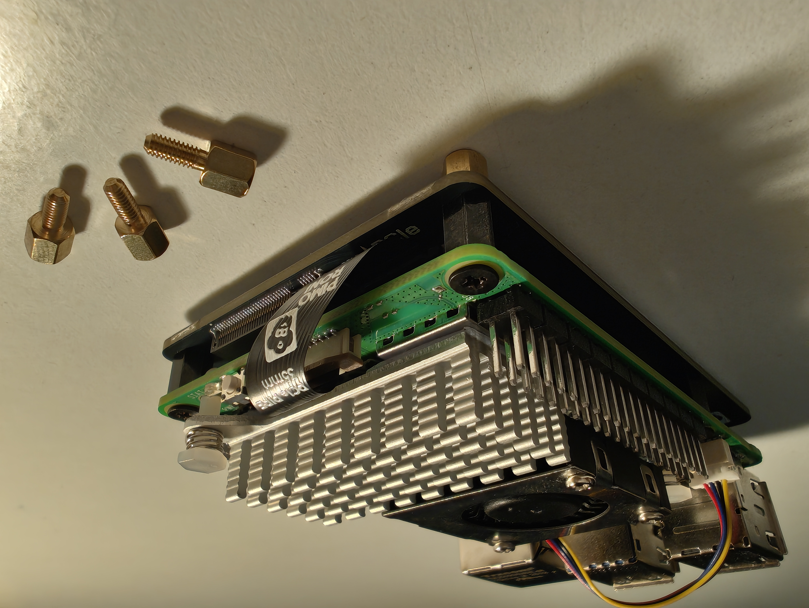

Now we place it onto the acrylic base of the case and secure it in place with 4 thin screws

  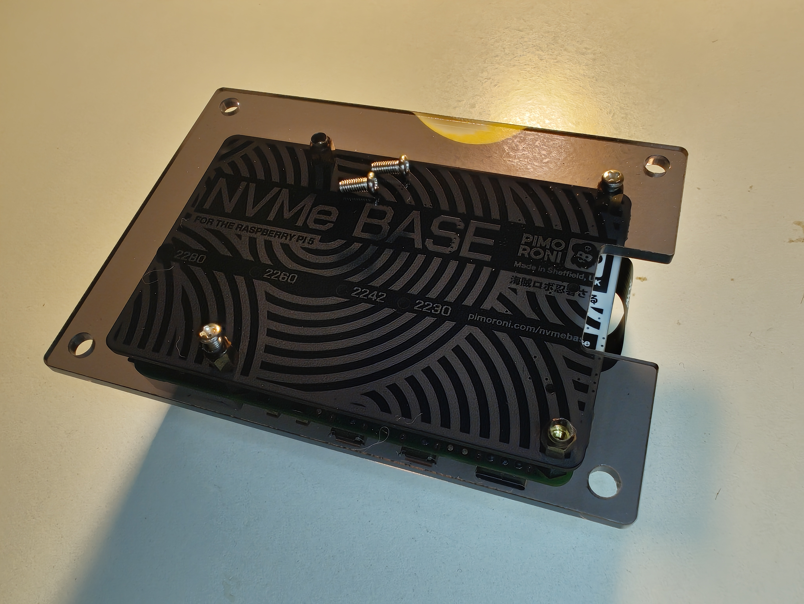

Then we shall put the big M3 brass spacer as "pillars" on the 4 sides of the base, putting the 4 bigger screws below them

  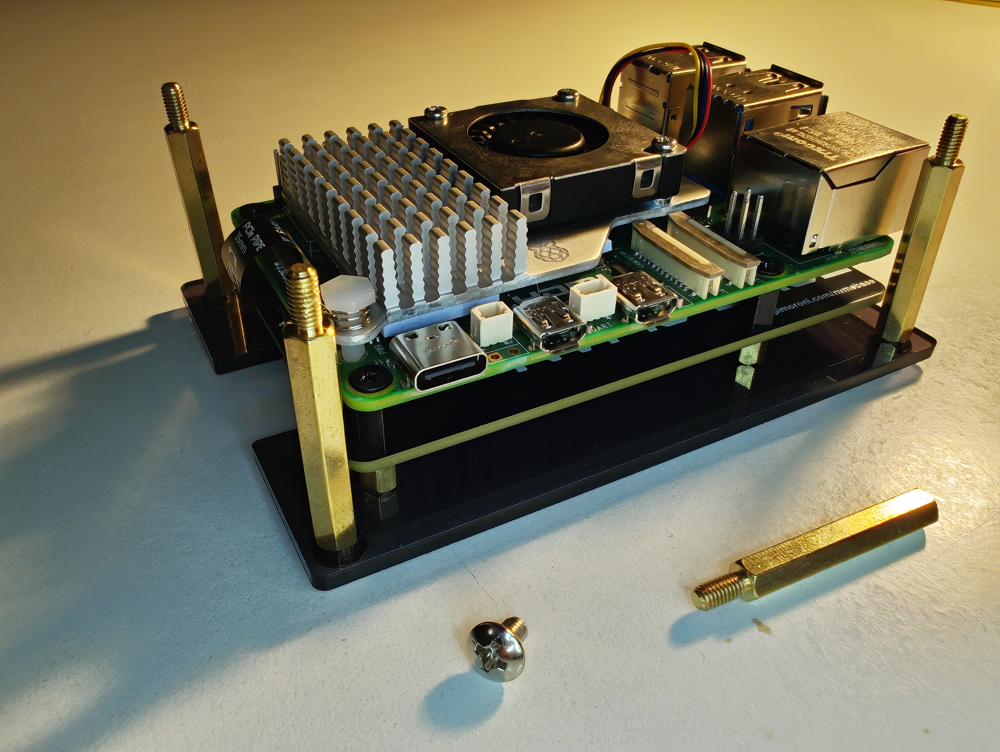

And for the last touch in the hardware aspect, we'll put the acrylic top on the top of the pillars (I concatenated 2 of them because of the extra height of the nvme base) and place the trims over

  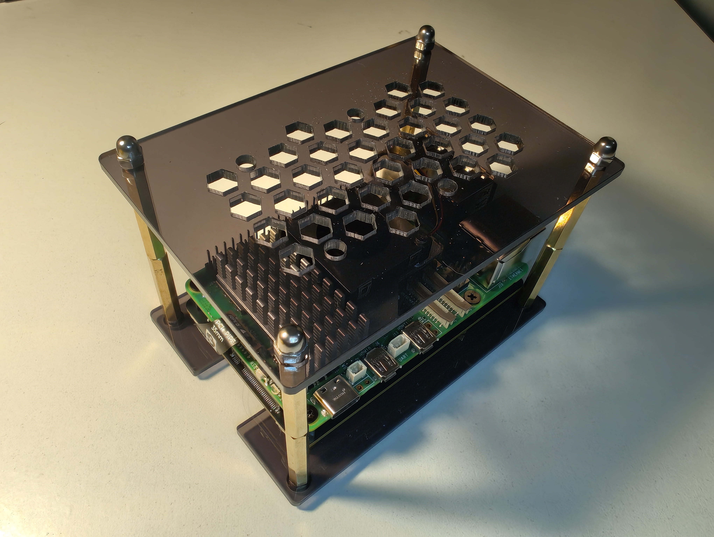

## Next Step

All the hardware installation is done, the next thing we are going to do is to configure the software needed to make the Raspberry Pi work as intended -> [Raspberry Pi Software](Raspberry%20Pi%20Software.md)

