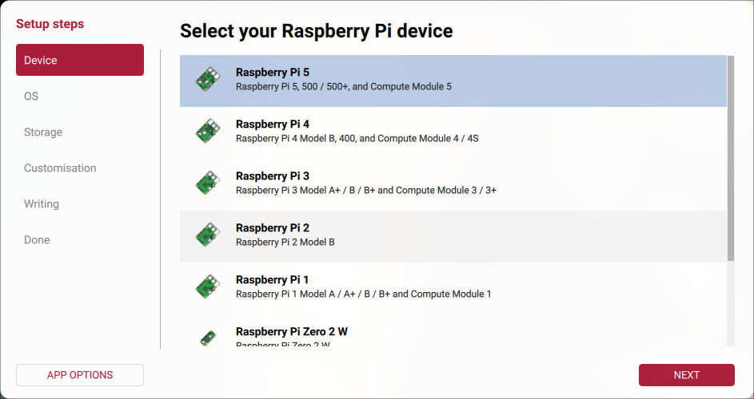
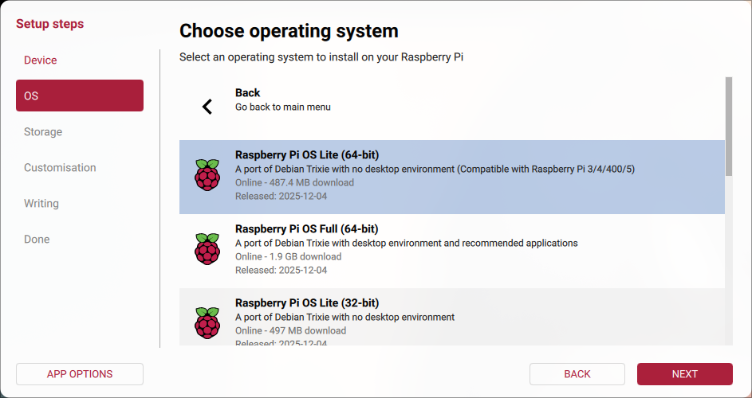
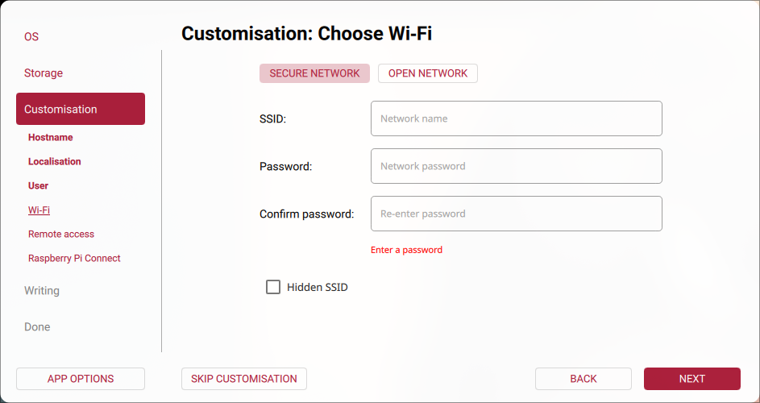
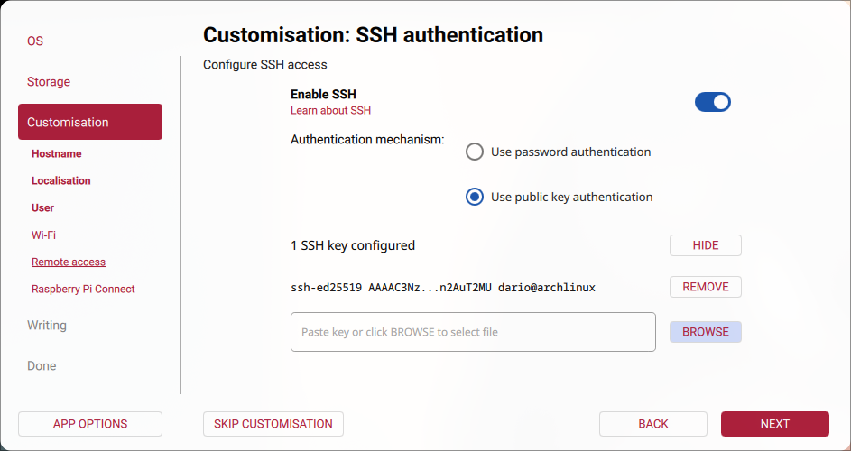

# Raspberry Pi Hardware
## O.S. Installation
To get the operative system running we need the [Raspberry Pi Imager](https://www.raspberrypi.com/software/) software and an microSD connected to our PC.

  

Now lets follow the steps, for this project i'll pick the Raspberry Pi OS Lite (Debian without desktop environment).

  

Pick the microSD that is connected to your computer and fulfill the following questions that asks.

We don't have to configure the WiFi because we are using the ethernet port.

  

Now lets enable the ssh and pick the public key authentication adding our public ssh key to have access.

  

And lets keep disabled the Raspberry Pi Connect.

Thats done, now connect the ethernet cable from the raspberry to your router, put on the microSD we just made and connect the power suply to make it start.