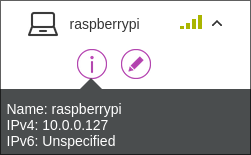
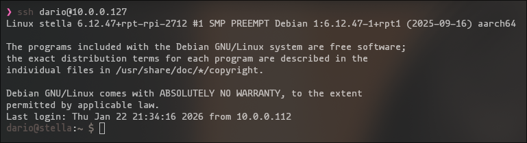
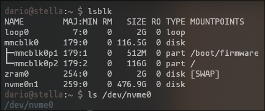

# Raspberry Pi Hardware
## O.S. Installation
To get the operative system running we need the [Raspberry Pi Imager](https://www.raspberrypi.com/software/) software and an microSD connected to our PC.
<div align="center">
  
</div>
Now lets follow the steps, for this project i'll pick the Raspberry Pi OS Lite (Debian without desktop environment).
<div align="center">
  
</div>
Pick the microSD that is connected to your computer and fulfill the following questions that asks.

We don't have to configure the WiFi because we are using the ethernet port.
<div align="center">
  
</div>
Now lets enable the ssh and pick the public key authentication adding our public ssh key to have access.
<div align="center">
  
</div>
And lets keep disabled the Raspberry Pi Connect.

Thats done, now connect the ethernet cable from the raspberry to your router, put on the microSD we just made and connect the power suply to make it start.


## NVMe Drive as Main
Once connected and running, we'll access it via ssh to make the nvme be the OS host and only disk.

To get the current assigned ip we'll watch on the router's admin web which device is connected to the LAN and what is his ip address
<div align="center">
  
</div>
Once get the ip address, we can connect via ssh.
<div align="center">
  
</div>
To start of, lets update the system and the eeprom bootloader to make all work flawlessly, we can do this with:

```bash
sudo apt update && sudo apt upgrade -y
sudo rpi-eeprom-update -a
sudo reboot
```
Now, lets check if our Raspberry Pi can read the NVMe that we installed on the pimroni base to do that you should check if the /dev/nvme0n1 appears on your system, you can watch it with this commands:

```bash
lsblk
ls /dev/nvme0
```
<div align="center">
  
</div>
If it appears, we can continue.

We'll install the Raspberry Pi Imager software on our Raspberry so we can install from there to the nvme the OS. You can install it (And some libraries to make it work) with:

```bash
sudo apt install rpi-imager libopengl0 ffmpeg libsm6 libxext6 libegl1 -y
```
Now, we need to make ssh with the -X flag

```bash
ssh -X name@ip
```
Execute the rpi-imager with

```bash
sudo -E rpi-imager
```
And fulfill every step like we did the first time with the microSD (Be patient is going to be slow).

Once done we can shutdown our Raspberry Pi and remove the microSD and it should boot nicely from the NVMe.

## Automatic Security Updates

I'll put that our system update itself automatically to get all the security updates.

To download the needed packet run:

```bash
sudo apt update
sudo apt dist-upgrade
sudo apt install unattended-upgrades
```

Once downloaded, run the following:

```bash
sudo dpkg-reconfigure --priority=low unattended-upgrades
```

And lastly press enter on the pop-up menu, that's it.

## O.S. Config
We'll do that when we shutdown our Raspberry the pciexpress port shutdowns too, so we can avoid data loss and similar related things:

To do that we'll need to change POWER_OFF_ON_HALT to 1 on the eeprom (bootloader) of the Raspberry, so, to edit it let's do:

```bash
sudo rpi-eeprom-config -e
```
And change or add the next line:

```bash
POWER_OFF_ON_HALT=1
```
And lastly we'll change some ssh config to prevent attacks, to do that lets modify the sshd_config.

```bash
sudo vim.tiny /etc/ssh/sshd_config
```
Once inside, we'll comment everything, only having the next lines:

```bash
Include /etc/ssh/sshd_config.d/*.conf
PubkeyAuthentication yes
AuthorizedKeysFile      .ssh/authorized_keys
PasswordAuthentication no
Subsystem       sftp    /usr/lib/openssh/sftp-server
```
Thats all we need to do on the OS, we didnt put a firewall like iptables because we are going to port forward only the port 22, 80 and 443 so every attack to any other port will not work and stay at the router.


## Next Step
All the software initial installation and configuration is done, the next thing we are going to do is to configure the router to give the Raspberry Pi an static ip address and port forwarding -> [Router Configuration](Router%20Configuration.md)
