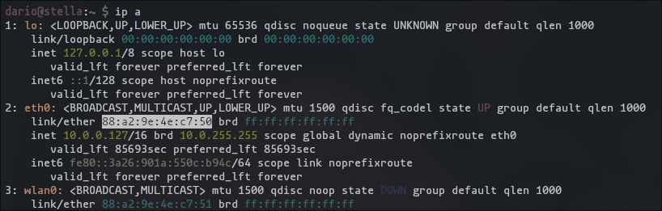
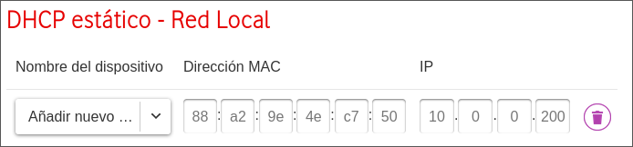
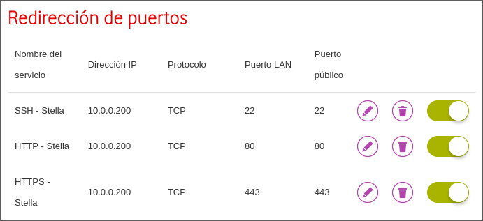
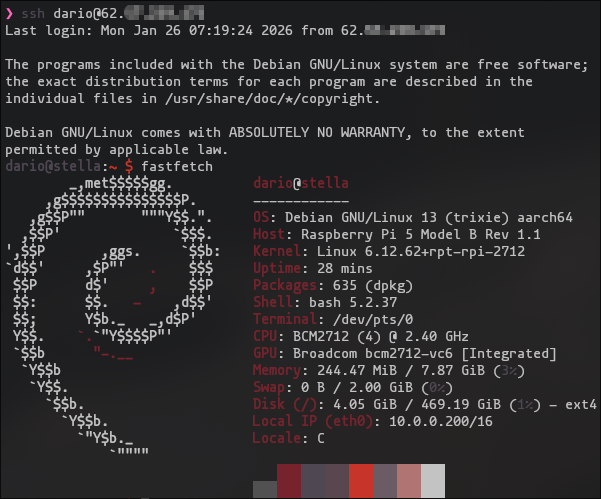

# Router Configuration
## Static IP
As mentioned before we'll start making so the DHCP server (Assigns the ips automatically on our local private network) assigns always the same ip address to our Raspberry Pi.

To do that we need the MAC address of our ethernet port, so we shall ssh to the raspberry pi and execute the following.
```bash
ip a
```
This is what are we looking for (The text highlighted), remember it should be on the eth0 interface (Ethernet 0).
<div align="center">
  
</div>
Once get, shutdown the Raspberry Pi and open the admin page of your ethernet router (It should come on the label behind the device).

Every ISP is different, you need to find something similar to `Static DHCP - Local Network`, in my case it is on the Advanced mode on Configuration -> LAN.

Once found, you need to place the MAC we got before and assign an IP address of your preference, remember that it should be on your local network (keeping the same network address and only changing the host address)

Avoid the ip addresses that are close to the start of the dhcp assignment (The ones from 0-100 or so) because they can be assigned to other local devices and not your Raspberry.
<div align="center">
  
</div>
When your router reboots you can start your Raspberry Pi and it should get the IP address you just assigned (Remember that now the ssh command changes to the new ip).

## Port Forwarding
To get the Port Forwarding to work you will need a PublicIP address, it doesn't need to be static, you can be behind a NAT on your ISP, but make sure you are not behind a CGNAT, if you are you should call your ISP so they give you a public ip address, each company handles it different.

To set it, once you are sure that you have an public IP (You don't need to know which one exactly), open again the admin page of your router and find something like `Port Forwarding` in my case it is on Internet -> Port Forwarding.

And we are gonna add 3 rules to the port forwarding, we want to make that all the trafic that comes to our public IP to the ports 22 (ssh), 80 (http) and 443 (https) its redirected to the same port to the Raspberry, in that way we can access to it from anywere.
<div align="center">
  
</div>
Once applied it should work, to try if it applied correctly we can try to do an ssh to our Raspberry but changing the IP address (Before 10.0.0.200) to the public IP we can get if we go to pages like [whatsmyipadress.com](https://whatismyipaddress.com/)
<div align="center">
  
</div>
If we can access to our Raspberry Pi, the port forwarding is set and done.

## Next Step
All the router touches are done, the next and last thing to do for the set up is to configure the DNS to get a domain pointing to our public IP-> [DNS Configuration](DNS%20Configuration.md)
