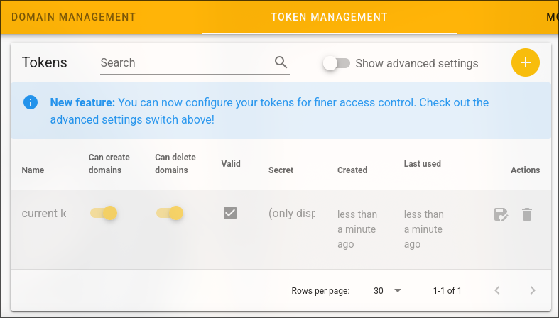

# SSL/TLS Certificate
To obtain our SSL/TLS certificate automatically we'll need a ACME (Automatic Certificate Management Environment) that supports deSEC and configure it.

In this case I am using [lego](https://github.com/go-acme/lego) a Let's Encrypt client and ACME library written in Go with his native [deSEC integration](https://go-acme.github.io/lego/dns/desec/), these are the exact steps i followed:
## Installation

There are a lot of ways to install it, but we're going to install the pre-compiled binary from the [releases page](https://github.com/go-acme/lego/releases) from the original repo.

Be careful because to the Raspberry Pi 5 you will need to use the `linux_arm64` package, you can install it using the following command (You can change it to a newer version if there is any):

```bash
wget https://github.com/go-acme/lego/releases/download/v4.31.0/lego_v4.31.0_linux_arm64.tar.gz
```

Once installed the package on your Raspberry Pi, lets decompress the file and put the binary on the `/usr/bin` directory for an easier access from anywhere:

```bash
tar -xzf lego_v*_linux_arm64.tar.gz
sudo mv lego /usr/bin
```

And thats it, if you do

```bash
lego --version
```

You should see the corresponding version you downloaded.

## Acquisition
Now lets configure lego to get us the certificate.

First of all we need a deSEC token for lego to interact with the deSEC API to create some needed records, to get it, go to the `TOKEN MANAGEMEN` window on deSEC and create a new token with the + icon
<div align="center">
  
</div>

You only need to put a token name and press create, be careful and copy the displayed token because it is the only time you will see it, if you loose the token you will need to erase it and create a new one.
<div align="center">
  
</div>

Now, on your Raspberry Pi, execute the following command to obtain the desired certificate:

```bash
DESEC_TOKEN=x-xxxxxxxxxxxxxxxxxxxxxxxxxx \
lego --dns desec -d '*.example.com' -d example.com --dns.propagation-wait 300s run
```

It will take a while and when finished it should have created a directory .lego on the current working directory, you can see the certificates with the next command:

```bash
ls -1 ./.lego/certificates
```

## Renewal
Lets make a systemd timer and systemd service to renew the certificate automatically.

To do that we need to create the `/etc/systemd/system/cert_renewal.timer` and `/etc/systemd/system/cert_renewal.service`, with the following content each one:

- /etc/systemd/system/cert_renewal.timer

```bash
[Unit]
Description=Renew certificates timer

[Timer]
Persistent=true
# avoid:
#OnCalendar=*-*-* 00:00:00
#OnCalendar=daily

# instead, use a randomly chosen time:
OnCalendar=*-*-* 3:35
# add extra delay, here up to 1 hour:
RandomizedDelaySec=1h

[Install]
WantedBy=timers.target
```

-  /etc/systemd/system/cert_renewal.service

```bash
[Unit]
Description=Renew certificates service

[Service]
Type=oneshot
Environment="DESEC_TOKEN=x-xxxxxxxxxxxxxxxxxxxxxxxxxx"
ExecStart=/usr/bin/lego --dns desec -d '*.example.com' -d example.com --dns.propagation-wait 300s --path /path/.lego renew
User=example
```

	Where `/path` is the path where initially generated the lego run command

Once created both the files, you should enable and start the timer with:

```bash
sudo systemctl enable cert_renewal.timer
sudo systemctl start cert_renewal.timer
```

And that's it, now we have a wildcard certificate acquired and renewed automatically.

## Next Step
Now we have an ssl/tts certificate always working, now, lets make our dns update its IP address like a dynDNS -> [DNS Update](DNS%20Update.md)